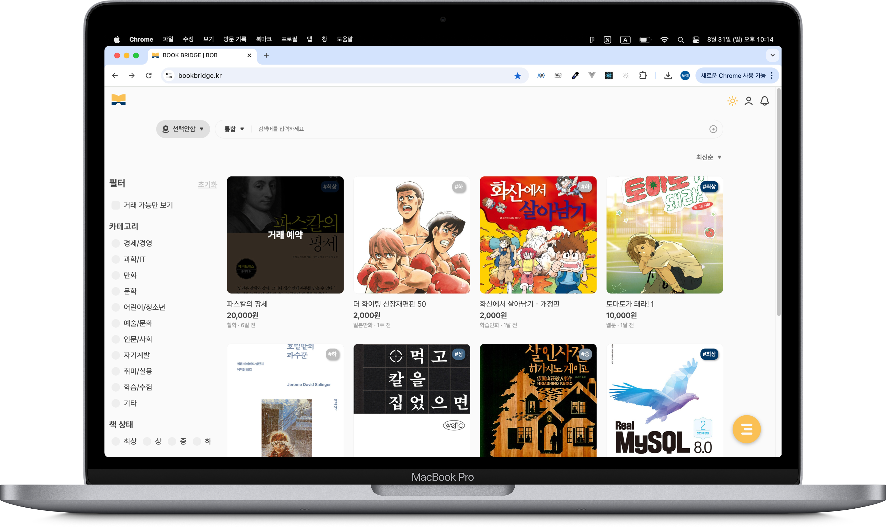
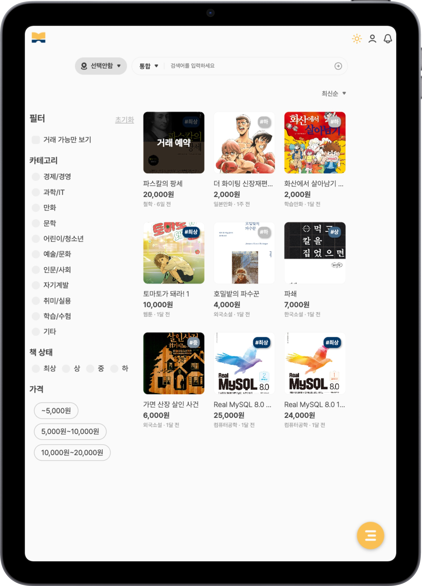
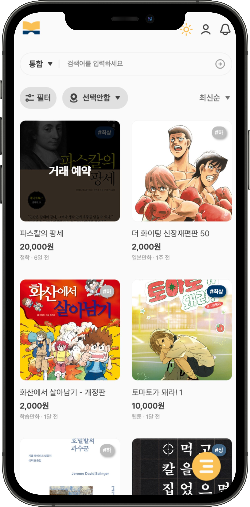
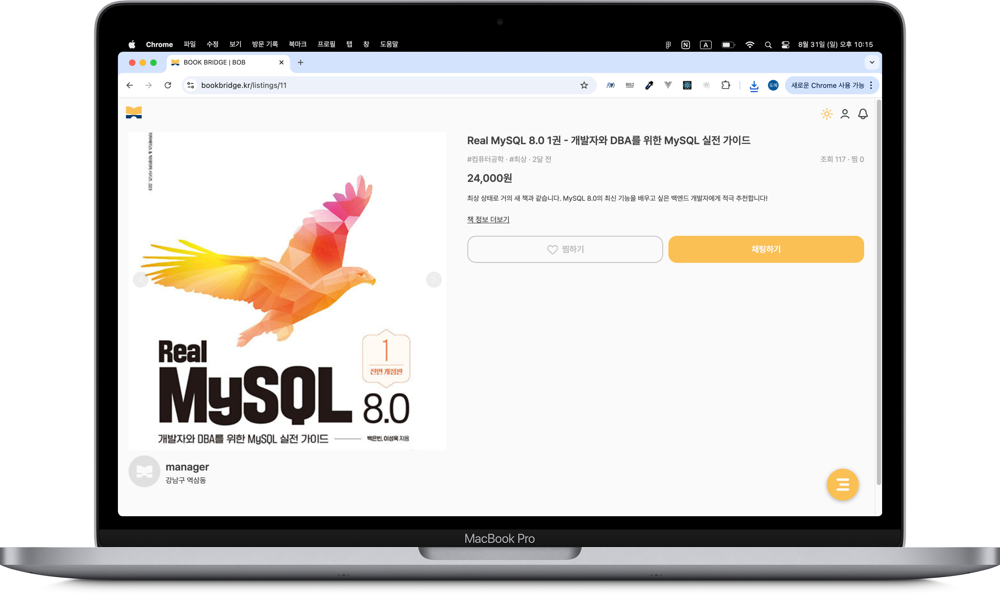
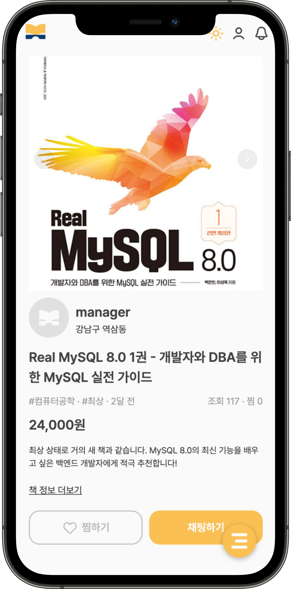
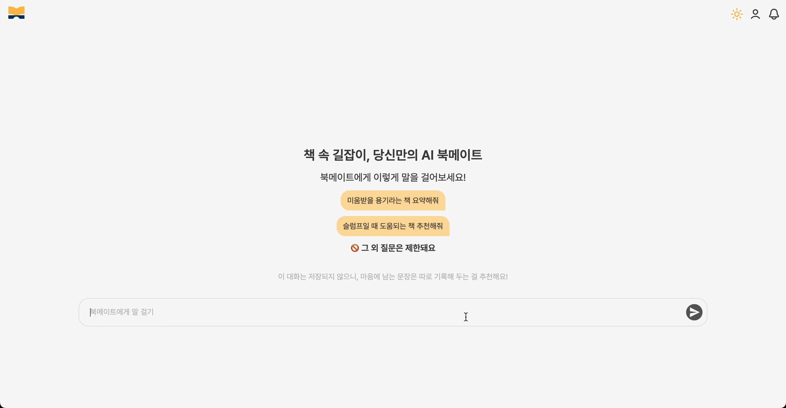

# BookBridge

**서비스 소개**

> **사람과 책을 잇는 사용자 친화적 중고책 교환 서비스**

**개발 기간**

> 2025.04 ~ 현재

  

### 💡 주요 기능

**1. 회원 관리**

- 회원가입/로그인, 소셜 로그인, 프로필 수정
- 관심 게시글, 내 게시글, 교환 희망 도서, 교환 신청 내역, 관심 키워드 관리

**2. 도서 등록 및 검색**

- 도서 정보·이미지·상태를 입력해 교환글 등록
- 제목, 저자, 카테고리, 상태 기반 도서 검색

**3. 교환 기능**

- 거래 성사 이후 채팅 기능 제공
- 거래 상태 변경(예약 중/교환 완료)
- 거래에 사용될 도서 변경

**4. AI 북메이트 (AI 서비스)**

- 사용자 요청 기반 도서 추천 및 책 줄거리 요약 제공

**5. 알림**

- 메시지 수신, 거래 상태 변경 시 실시간 알림
- 알림 목록 확인

 

### 🛠️ 기술 스택

> 백엔드

> 프론트엔드

 

### 📺 화면 미리보기

> **메인페이지**

|                               desktop                               |                               tablet                               |                               mobile                               |
| :-----------------------------------------------------------------: | :----------------------------------------------------------------: | :----------------------------------------------------------------: |
|  |  |  |

  

> 교환글 상세 페이지

|                                desktop                                |                                mobile                                |
| :-------------------------------------------------------------------: | :------------------------------------------------------------------: |
|  |  |

  

> AI 북메이트

  

### 👨‍👧‍👦 팀원 소개

|  이현수  | 김도예 |
| :------: | :----: |
| BE/Infra |   FE   |
